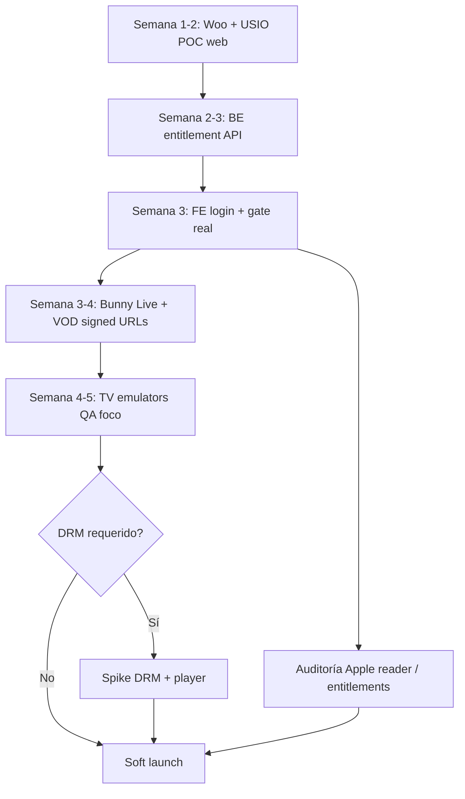

# Plan técnico — DRM, Live, Emuladores TV, WooCommerce + USIO, Apple IAP

Documento de **plan + datos** para el proyecto Stu & Laurie Streaming.  
Complementa [`GUIA-FE.md`](./GUIA-FE.md).

**Stack acordado (referencia):**

| Capa | Tecnología |
| --- | --- |
| FE consumo | React Native / Expo + RN Web |
| BE | Node.js |
| DB | PostgreSQL |
| Video | Bunny Stream (alt. Mux) |
| Pagos | USIO |
| Hosting | AWS |
| Admin / e‑commerce | React/Next + **WooCommerce** (usuarios/subs) |

---

## Resumen ejecutivo (leé esto primero)

| Tema | Dificultad | Dueño principal | ¿Se puede empezar ya? |
| --- | --- | --- | --- |
| Live streaming (Bunny) | Media | BE + Video + FE player | Sí (FE ya reproduce HLS) |
| DRM nativo | Alta | BE licenses + FE player nativo | Spike primero; no al final |
| Emuladores TV | Baja/Media | FE | Sí (setup máquina) |
| WooCommerce + USIO + users | Alta | WordPress/Woo + BE sync | Definir arquitectura ya |
| Riesgo rechazo Apple IAP | Alta (legal/producto) | PM + legal + FE UX | Checklist YA |

**Orden recomendado de trabajo**

```
1. Usuarios/suscripciones vía Woo + USIO (fuente de verdad “¿pagó?”)
2. Bunny Live + VOD sin DRM (URLs firmadas)
3. FE: entitlement real + playback
4. TV emulators + QA foco
5. DRM (si el cliente lo exige)
6. App Store: reader / external link / gating regional
```

---

# 1. DRM — código nativo

## 1.1 Para tontos

El video viaja cifrado. Solo el player autorizado (con license de FairPlay en Apple / Widevine en Android) lo abre. Sin eso, un HLS “abierto” se puede grabar o redistribuir más fácil.

## 1.2 Qué implica en React Native / Expo

| Plataforma | DRM | Dónde se implementa |
| --- | --- | --- |
| iOS / tvOS | **FairPlay Streaming (FPS)** | Nativo (AVPlayer + certificado FairPlay). Suele ser módulo Swift/Obj‑C o player comercial. |
| Android / Android TV | **Widevine** L1/L3 | ExoPlayer + license URL. Nativo o player comercial. |
| Web | Widevine / FairPlay según browser | Shaka / Bitmovin JS, distinto del app native. |

**Expo Go no alcanza** para DRM serio → hace falta **dev client / prebuild**.

### Opciones reales

| Opción | Pros | Contras |
| --- | --- | --- |
| **A. Player comercial** (Bitmovin, THEOplayer) | Menos dolor nativo, soporte, analytics | Costo licencia |
| **B. Bunny MediaCage Enterprise DRM** | Encaja con Bunny Stream | Costo + integración still non‑trivial en RN |
| **C. Open source + código nativo propio** | Control | Semanas de trabajo; alto riesgo de bugs |
| **D. Sin DRM al inicio** | Time‑to‑market | Solo tokens/URL firmada (protección débil vs piratería seria) |

## 1.3 Cómo implementarlo (plan)

### Fase 0 — Decisión (1 reunión)
- ¿DRM obligatorio en MVP o fase 2?
- ¿Budget para player comercial / MediaCage?

### Fase 1 — Spike (3–5 días)
1. Cuenta Bunny (o Mux) con un asset DRM de prueba.
2. BE expone: `playbackUrl` + `licenseUrl` + (FairPlay) `certificateUrl`.
3. Probar en **device físico** iOS y Android (simulador ≠ DRM real).
4. Elegir A/B/C.

### Fase 2 — Integración FE
1. Sustituir `expo-av` simple por player DRM‑capable.
2. Módulos nativos o SDK del vendor.
3. Flujo: login → entitlement → pedir license token al BE → play.
4. QA: offline, seek, background, TV.

### Fase 3 — Producción
- Rotación de keys, geobloqueo, caducidad corta de tokens, monitoring de fallos de license.

## 1.4 Qué hace el BE vs el FE

| BE | FE |
| --- | --- |
| Verifica suscripción | Muestra UI locked/unlocked |
| Firma URL / pide license al DRM vendor | Pasa license al player nativo |
| Nunca manda API keys de Bunny al app | Solo recibe tokens de corta vida |

## 1.5 Preguntas a cerrar
1. ¿DRM en MVP?
2. ¿FairPlay + Widevine en iOS/Android/TV/Web todos?
3. ¿Player comercial OK?
4. ¿Bunny MediaCage o otro?

---

# 2. Streaming en vivo — cómo implementarlo

## 2.1 Para tontos

1. Alguien en el estudio manda la señal (OBS / encoder) a **Bunny Stream Live**.
2. Bunny la convierte a **HLS**.
3. El FE pide al BE: “¿puedo ver el live X?” → recibe URL HLS (firmada).
4. El player nativo reproduce el `.m3u8`.

Esto **ya está parcial** en el FE: el player abre HLS. Falta el live **real** de Bunny + entitlement.

## 2.2 Arquitectura recomendada (Bunny)

```
Encoder (OBS)
    │  RTMP/SRT ingest
    ▼
Bunny Stream Live
    │  transcode → HLS
    ▼
CDN Bunny (playlist.m3u8)
    ▲
BE Node (auth + signed URL / token)
    ▲
App RN / TV / Web (player)
```

**URLs típicas Bunny (VOD; live sigue patrón HLS del pull zone):**

```text
https://{pullZone}.b-cdn.net/{videoId}/playlist.m3u8
```

Con token CDN (generado **solo en servidor**):

```text
...?token={hmac}&expires={unix}
```

Refs: [Bunny security](https://docs.bunny.net/stream/security), [Expo + Bunny playback](https://bunny.net/blog/native-video-playback-with-bunny-stream-and-expo/).

## 2.3 Pasos de implementación

### A. Bunny (ops / video)
1. Crear Video Library.
2. Habilitar **Live** (crear live stream / ingest endpoint).
3. Configurar token authentication en Pull Zone.
4. Probar ingest con OBS → verificar playlist en browser/VLC.

### B. Backend Node
1. Tabla `events` (id, title, startsAt, bunnyLiveId, status: scheduled|live|ended).
2. Endpoint `GET /playback/live/:id`:
   - JWT user
   - Check suscripción activa (desde Woo/BE)
   - Generar signed URL
   - Return `{ url, isLive, expiresAt }`
3. Webhook Bunny (opcional): live started / ended → actualizar status.
4. Post‑live: grabación → VOD en catálogo (live‑to‑VOD).

### C. Frontend
1. Home: card LIVE si `status === 'live'`.
2. Player: mismo componente HLS; badge LIVE; menos seek agresivo en live.
3. Reintentos si el stream aún no está up.
4. Countdown si `scheduled`.

### D. Admin (Next/Woo later)
- Crear evento, pegar ingest key, “Go live”.

## 2.4 Estimación grosera

| Trabajo | Esfuerzo (orden de magnitud) |
| --- | --- |
| Bunny live + OBS OK | 1–2 días |
| BE signed playback | 2–4 días |
| FE live UI + player hardening | 2–4 días |
| Live‑to‑VOD + admin mínimo | 3–5 días |
| **Total sin DRM** | ~1.5–3 semanas (1 FE + 1 BE) |

## 2.5 Preguntas
1. ¿Un solo canal live o varios concurrentes?
2. ¿Latency target (estándar HLS ~10–30s vs low‑latency)?
3. ¿Grabar automáticamente a VOD?
4. ¿Geo‑restriction?

---

# 3. Emuladores — Apple TV y Android TV

## 3.1 Android TV (Windows o Mac)

**Requisitos:** Android Studio (Iguana+), 16 GB RAM recomendados.

### Setup
1. Instalar [Android Studio](https://developer.android.com/studio).
2. **SDK Manager** → API 31+ → imagen **Android TV** (ARM 64 en Apple Silicon / x86_64 en Intel).
3. **Device Manager** → Create Device → categoría **TV** (ej. Android TV 1080p).
4. Arrancar el AVD.

### Correr este proyecto
```bash
npm run prebuild:tv          # EXPO_TV=1
npm run run:android:tv       # o: npx expo run:android
```
Elegir el emulador TV en la lista de devices.

### Control remoto en el emulador
- Flechas del teclado = D‑Pad  
- Enter = OK  
- Esc / Back = atrás  

## 3.2 Apple TV (solo macOS)

**Requisitos:** Mac, Xcode 16+, runtime **tvOS 17+**.

### Setup
1. Instalar Xcode desde App Store.
2. `xcodebuild -downloadAllPlatforms` (o Xcode → Settings → Platforms → tvOS).
3. Simulator → File → Open Simulator → **tvOS** → Apple TV 4K.

### Correr este proyecto
```bash
npm run prebuild:tv
npm run run:ios:tv
```

### Remoto en Simulator
- Flechas + Enter  
- Cmd+D → dev menu (RN)

## 3.3 Limitaciones importantes

| | Emulador/Sim | Device real |
| --- | --- | --- |
| Foco D‑Pad | Bueno para UI | Obligatorio para sign‑off |
| Performance | Orientativa | Real |
| DRM | Pobre / no confiable | Obligatorio |
| IAP / Store | No | Review device |

**Plan QA TV**
1. Emulador Android TV (Windows OK).  
2. Apple TV Simulator (Mac).  
3. Hardware: 1× Apple TV + 1× Chromecast/Google TV o Fire Stick.

## 3.4 Preview sin emulador
```bash
npm run web:tv   # EXPO_PUBLIC_FORCE_TV=1
```
Sirve para layout/rail; **no** reemplaza QA de foco nativo.

---

# 4. WooCommerce + usuarios + suscripciones + USIO

## 4.1 Para tontos

- **WooCommerce** = la tienda (cuenta, producto “Suscripción mensual”, historial).
- **USIO** = el que cobra la tarjeta/ACH (checkout / API).
- **App RN** = no cobra; pregunta al BE “¿esta cuenta tiene sub activa?” y reproduce.

No hay plugin oficial “USIO ↔ Woo Subscriptions” plug‑and‑play documentado como Stripe. La vía realista es **gateway custom** o **Checkout/Hosted USIO + sync a Woo**.

## 4.2 Arquitectura recomendada

```
┌─────────────────────┐     webhooks      ┌──────────────────┐
│  WooCommerce        │◄──────────────────│  USIO Checkout   │
│  + Woo Subscriptions│                   │  / Payments API  │
│  (users, plans)     │                   └──────────────────┘
└─────────┬───────────┘
          │ REST / webhook "subscription active/cancelled"
          ▼
┌─────────────────────┐
│  Node.js API        │  fuente que consume la APP
│  user ↔ woo_id      │
│  entitlement cache  │
└─────────┬───────────┘
          │ GET /me/entitlement
          ▼
┌─────────────────────┐
│  App RN / TV / Web  │
└─────────────────────┘
```

**Fuente de verdad comercial:** Woo (quién es el user, qué plan tiene).  
**Fuente de verdad de cobro:** USIO (transacción).  
**Fuente de verdad de la app:** BE Node (entitlement normalizado, rápido, cacheable).

## 4.3 Flujo usuario

1. User se registra en **web** (Woo / My Account) o vía checkout.
2. Elige plan → **USIO Checkout** (hosted o embedded) — PCI queda en USIO.
3. USIO confirma pago → gateway/plugin marca orden Woo **paid** → Subscription **active**.
4. Webhook Woo → BE Node actualiza `entitlements`.
5. App: login (email/password Woo JWT o magic link / Auth0 / custom) → `hasActiveSubscription: true` → play.

## 4.4 Qué hay que construir

| Componente | Trabajo |
| --- | --- |
| Woo + **WooCommerce Subscriptions** | Productos recurring, emails, customer portal |
| USIO gateway PHP (custom) o Hosted Page que cree órdenes Woo | Cobro + tokenización; **no hay SDK Node oficial maduro** |
| Sync BE (webhooks `woocommerce_subscription_*`) | Tabla users/entitlements |
| App FE | Login + manage subscription → URL Woo/My Account |
| Admin | Operadores ven subs en Woo; contenido en Next/Bunny |

## 4.5 Roles y datos mínimos

```text
User
  id, email, wooCustomerId, createdAt

Subscription
  userId, planId, status (active|past_due|cancelled),
  currentPeriodEnd, usioRef, wooSubscriptionId

Entitlement (vista para la app)
  userId, canStream: boolean, planName, renewsAt
```

## 4.6 Riesgos USIO + Woo

| Riesgo | Mitigación |
| --- | --- |
| Sin plugin oficial USIO | POC gateway 1 semana o Hosted Page + order sync |
| Recurrencia (renewals) | Confirmar que USIO soporta cobros recurrentes con token permanente |
| Staging vs prod keys | Dos merchants USIO + Woo staging |
| Desync app | Webhooks + job de reconciliación diario |

## 4.7 Estimación grosera

| Pieza | Esfuerzo |
| --- | --- |
| Woo + Subscriptions setup | 2–3 días |
| USIO checkout POC en web | 3–7 días (según custom vs hosted) |
| Webhooks → Node entitlement | 3–5 días |
| FE login + gate real | 2–4 días |
| **Total integración cobro+users** | ~2–4 semanas |

## 4.8 Preguntas
1. ¿Woo es ya el sistema de usuarios del cliente o se crea de cero?
2. ¿Planes: solo monthly/annual o también PPV live?
3. ¿USIO Hosted Page OK o quieren checkout embebido en el sitio?
4. ¿Quién desarrolla el plugin PHP Woo↔USIO?
5. ¿Login de la app = credenciales Woo o SSO aparte?

---

# 5. Rechazo de Apple por In‑App Purchase

## 5.1 El problema

Apple (Guideline **3.1**) quiere que el contenido digital / suscripciones se cobren con **IAP**, salvo excepciones.  
Una app de **video por suscripción** que mete “Comprá acá $9.99” sin IAP es candidata fuerte a **rechazo**.

## 5.2 Buenas noticias / matices 2025–2026 (verificar siempre con legal)

El proyecto es de **Florida / US** → storefront US importa.

1. **Reader apps** (video como función principal): pueden pedir **External Link Account Entitlement** para link a web de cuenta/suscripción.  
   Docs: [Reader apps](https://developer.apple.com/support/reader-apps/).

2. Tras Epic, en **US** hay más margen para links a pago externo, pero:
   - Puede requerir **entitlements** y reporting.
   - **No es igual en todos los países**.
   - Las rules siguen moviéndose (comisiones externas en disputa judicial).

3. **tvOS** se revisa con la misma lógica de contenido digital: no improvisar checkout “web embebido” agresivo.

> **Esto no es consejo legal.** PM/legal debe firmar la estrategia antes del submit.

## 5.3 Estrategia recomendada para este producto

### Modelo “Reader + billing web” (alineado al brief)

| En la app iOS/tvOS | En la web |
| --- | --- |
| Login | Registro |
| Ver contenido si ya pagó | Checkout USIO + Woo |
| “Manage subscription” → Safari (link oficioso) | Cancelar / cambiar plan |
| **No** precios ni botones “Buy now $X” hard‑sell (salvo que entitlement US lo permita y esté aprobado) | Toda la venta |

### Checklist FE anti‑rechazo

- [ ] Ningún StoreKit compra bypass casero  
- [ ] CTA de suscripción abre **web** (ASWebAuthenticationSession / `Linking.openURL`)  
- [ ] Copy: “Already subscribed? Sign in” primero  
- [ ] Review notes en App Store Connect: demo user **con** sub activa + explicación del modelo reader  
- [ ] Gating por storefront si mostrar links de compra externos solo en US  
- [ ] Solicitar **External Link Account** si van a linkear cuenta/billing  
- [ ] Android: Google Play tiene reglas propias (en general web billing de subs digitales también es sensible; no asumir “todo vale”)

### Qué pasa si igual rechazan
1. Responder con categoría reader + entitlement.  
2. Quitar CTAs de compra de iOS; dejar solo login + restore access.  
3. Último recurso: IAP + dinero fuera de USIO en Apple (cambia el modelo comercial).

## 5.4 Plan de mitigación (calendario)

| Cuándo | Acción |
| --- | --- |
| Ahora | Decisión escrita: reader‑only vs híbrido IAP |
| Antes del primer TestFlight | Abrir ticket External Link Account si aplica |
| UI freeze iOS | Auditoría de strings/botones Subscribe |
| Submit | Review notes + cuenta demo premium |
| Si reject | Patch en &lt; 1 semana según feedback |

## 5.5 Preguntas
1. ¿Solo storefront United States al inicio?
2. ¿Legal/PM acepta reader + link web (sin IAP)?
3. ¿Quién pide el entitlement en App Store Connect?
4. ¿tvOS mismo flujo que iOS?

---

# 6. Plan integrado (roadmap)



### Hitos de aceptación

| Hito | Hecho cuando… |
| --- | --- |
| Cobro | User paga en web USIO → Woo sub active → app desbloquea en &lt; 2 min |
| Live | OBS → Bunny → app reproduce con user premium |
| TV | Emulador Android TV + Simulator Apple TV pasan checklist de foco |
| Store | Estrategia Apple documentada + UI iOS auditada |
| DRM | (si aplica) 1 título FairPlay + 1 Widevine en device real |

---

# 7. Responsabilidades por equipo

| Tema | FE | BE/Node | Woo/USIO | Legal/PM |
| --- | --- | --- | --- | --- |
| DRM nativo | Player + spike | License/token APIs | — | Decide si MVP |
| Live | UI + HLS play | Signed URL + events | — | |
| Emuladores TV | Setup + QA | — | — | Devices must‑have |
| Users/subs | Login + manage link | Entitlement sync | Woo + USIO gateway | |
| Apple IAP | UI compliant | — | — | Estrategia + entitlements |

---

# 8. Links útiles

- Apple reader apps: https://developer.apple.com/support/reader-apps/  
- App Store Guidelines 3.1: https://developer.apple.com/app-store/review/guidelines/  
- Bunny Stream security: https://docs.bunny.net/stream/security  
- Bunny + Expo playback: https://bunny.net/blog/native-video-playback-with-bunny-stream-and-expo/  
- Expo TV: https://docs.expo.dev/guides/building-for-tv/  
- USIO Checkout: https://checkout.usiopay.com/2.0/documentation/  
- USIO Payments: https://payments.usiopay.com/2.0/documentation/  
- Woo Subscriptions (dev): https://woocommerce.com/document/subscriptions/develop/  

---

*Plan FE/arquitectura · Stu & Laurie Streaming · jul 2026 · actualizar tras respuestas de legal y decisión DRM.*
